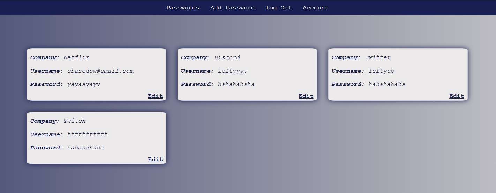

# Password Vault

Password Vault is an app where a user can store all their passwords under one domain. 

# Getting Started

Access the app [here](https://cb-password-vault.herokuapp.com/) 

# Screenshot

# Technologies Used

  
  
  

  

  

  

  

  

  

  
  

# Stretch Goals

-  Implement company logo api 
-  Have cards be toggled off of hidden/unhidden
-  Implement encryption to make the passwords more secure.
